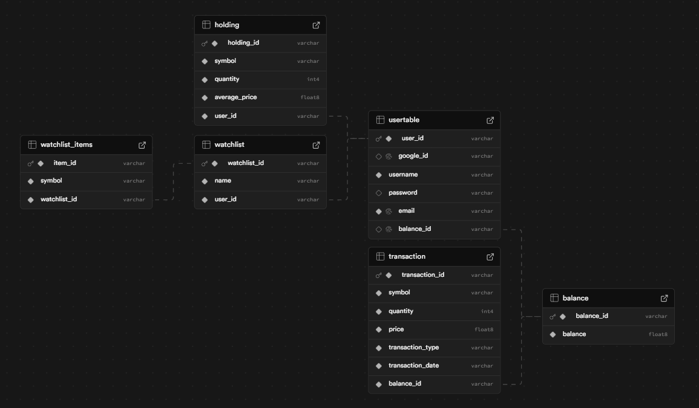

# Quantify — A Modern Trading & Investment Platform 📈
_Last updated: August 17, 2025_

Quantify is a real-time market data and portfolio tracking platform designed to keep investors effortlessly informed. It provides secure user management, portfolio/watchlist APIs, real-time trade feeds, and AI-powered company insights. The backend is live and ready for frontend integration, with a roadmap toward asynchronous paper trading, Redis caching, and advanced analytics.

- Live API Base URL: https://quantify-mwks.onrender.com
- API Documentation (Swagger UI): https://quantify-mwks.onrender.com/swagger-ui/index.html

> Status: Backend live; frontend in progress; trading engine and Redis caching planned.

---

## Table of Contents

1. Overview
2. Key Features
   - Available Now
   - Coming Next
3. Technology Stack
4. System Architecture
5. Database Schema
6. Getting Started (Local Development)
   - Prerequisites
   - Clone
   - Configure
   - Run (Maven)
   - Optional: Docker & Docker Compose (planned)
7. Configuration Reference
8. Real-Time WebSocket Feed
9. Roadmap & Project Status
10. Contributing
11. Security
12. License
13. Contact

---

## 1) Overview

Quantify delivers:
- A high-performance Spring Boot backend with secure authentication
- REST APIs for users, portfolios, transactions, and watchlists
- Aggregated real-time market data via WebSockets
- AI-powered company insights via Gemini

This README includes setup instructions, architecture overview, configuration guidance, and a roadmap for current and upcoming work.

---

## 2) Key Features

### Available Now
- Secure authentication
  - Email/password (session-based) with Spring Security
  - Google OAuth 2.0 login
- User & Portfolio APIs
  - User management and profile endpoints
  - Portfolio, holdings, transactions, and watchlist CRUD
- Market data integration
  - Aggregation from Alpha Vantage, Yahoo Finance, and Finnhub (via WebClient)
- Real-time data stream
  - WebSocket endpoint (/ws/trades) using STOMP to bridge Finnhub live trade feed
- AI insights
  - Gemini-powered company insights endpoint (deployed)

### Coming Next
- Frontend (React)
  - Responsive UI for auth, dashboard, portfolio, trading, and watchlists
  - WebSocket integration for live prices
- Asynchronous paper trading
  - RabbitMQ-based producer/consumer to process buy/sell orders
- Redis caching
  - Cache high-traffic read endpoints (e.g., quotes) to reduce external API calls
- DevOps & quality
  - Dockerization and docker-compose for Postgres, RabbitMQ, Redis
  - GitHub Actions CI/CD
  - Logging via SLF4J; improved security context usage

---

## 3) Technology Stack

- Backend: Java 21, Spring Boot 3, Spring Security, Spring WebFlux/WebClient, Spring Data JPA
- Database: PostgreSQL
- Real-time: STOMP over WebSocket
- External Data: Finnhub, Alpha Vantage, Yahoo Finance
- AI: Google Gemini
- Messaging (planned): RabbitMQ
- Caching (planned): Redis
- DevOps (planned): Docker, Docker Compose, GitHub Actions (CI/CD)

---

## 4) System Architecture

1. Spring Boot application (multi-layered, DI)
2. PostgreSQL for persistence (Users, Holdings, Transactions, Watchlists, etc.)
3. Market data aggregation via external APIs (Alpha Vantage, Yahoo Finance, Finnhub)
4. WebSocket/STOMP endpoint (/ws/trades) for live trade updates
5. AI Insights endpoint backed by Gemini
6. Planned:
   - RabbitMQ for async trade processing
   - Redis for low-latency caching of market data

---

## 5) Database Schema

The application uses a normalized PostgreSQL schema to manage user, portfolio, watchlist, and transaction data.



---

## 6) Getting Started (Local Development)

### Prerequisites
- Java 21 (JDK)
- Git
- PostgreSQL (local or via Docker)
- Optional (planned): Docker & Docker Compose (for Postgres, RabbitMQ, Redis stack)

### 1) Clone the Repository
```bash
git clone https://github.com/Soumyadip-gole/Quantify.git
cd Quantify
```

### 2) Configure Environment
This project uses an application.properties file for configuration. Since it contains sensitive information, it is ignored by Git.

1. Create `src/main/resources/application.properties`
2. Copy the contents from `application-example.properties` (if present)
3. Replace placeholders with your actual credentials and API keys

See Configuration Reference below for keys and example values.

### 3) Run the Application (Maven)
You can run the application from your IDE or via Maven:

```bash
./mvnw spring-boot:run
```

- Local URL: http://localhost:8080
- Swagger UI: http://localhost:8080/swagger-ui/index.html

### Optional: 4) Run Dependencies with Docker Compose (planned)
A docker-compose.yml is planned to simplify local setup for PostgreSQL, RabbitMQ, and Redis. Example (to be added to the repo):

```yaml
version: "3.9"
services:
  postgres:
    image: postgres:16
    container_name: quantify-postgres
    environment:
      POSTGRES_DB: quantify
      POSTGRES_USER: postgres
      POSTGRES_PASSWORD: postgres
    ports:
      - "5432:5432"
    volumes:
      - pg_data:/var/lib/postgresql/data

  rabbitmq:
    image: rabbitmq:3-management
    container_name: quantify-rabbitmq
    ports:
      - "5672:5672"
      - "15672:15672" # management UI

  redis:
    image: redis:7
    container_name: quantify-redis
    ports:
      - "6379:6379"

volumes:
  pg_data:
```

You would then run:
```bash
docker compose up -d
```

---

## 7) Configuration Reference

Create `src/main/resources/application.properties` with values similar to:

```properties
# --- Database ---
spring.datasource.url=jdbc:postgresql://localhost:5432/quantify
spring.datasource.username=postgres
spring.datasource.password=YOUR_DATABASE_PASSWORD_HERE
spring.jpa.hibernate.ddl-auto=update

# --- Swagger/OpenAPI (if applicable) ---
springdoc.api-docs.enabled=true
springdoc.swagger-ui.enabled=true

# --- Security: OAuth2 (Google) ---
spring.security.oauth2.client.registration.google.client-id=YOUR_GOOGLE_CLIENT_ID
spring.security.oauth2.client.registration.google.client-secret=YOUR_GOOGLE_CLIENT_SECRET
spring.security.oauth2.client.registration.google.scope=openid,profile,email
spring.security.oauth2.client.registration.google.redirect-uri={baseUrl}/login/oauth2/code/google

# --- External APIs ---
alpha.vantage.api.key=YOUR_ALPHA_VANTAGE_KEY
finnhub.api.key=YOUR_FINNHUB_KEY
# If used: yahoo.finance.api.key=YOUR_YAHOO_KEY

# --- AI (Gemini) ---
gemini.api.key=YOUR_GEMINI_API_KEY

# --- WebSocket (typical Spring defaults; adjust if customized) ---
spring.websocket.path=/ws/trades

# --- Caching (planned) ---
# spring.cache.type=redis
# spring.data.redis.host=localhost
# spring.data.redis.port=6379

# --- Messaging (planned) ---
# spring.rabbitmq.host=localhost
# spring.rabbitmq.port=5672
# spring.rabbitmq.username=guest
# spring.rabbitmq.password=guest

# --- Logging ---
# Use SLF4J + Logback configuration as needed
```

Notes:
- Current auth is session-based for email/password. JWT support is under evaluation (see Roadmap).
- You must supply your own API keys for Alpha Vantage, Finnhub, and Gemini.

---

## 8) Real-Time WebSocket Feed

Quantify exposes a WebSocket endpoint that bridges to Finnhub’s real-time trade stream.

- Endpoint: `/ws/trades` (STOMP)
- Connect using a STOMP WebSocket client from the browser or server
- Subscribe to the destination(s) exposed by the backend (see code/config); the server relays live trade messages

Example (JavaScript, using @stomp/stompjs):
```js
import { Client } from '@stomp/stompjs';

const client = new Client({
  brokerURL: 'ws://localhost:8080/ws/trades', // use wss:// for production SSL
  reconnectDelay: 5000,
});

client.onConnect = () => {
  // Replace with your actual destination (e.g., '/topic/trades')
  client.subscribe('/topic/trades', message => {
    console.log('Trade update:', JSON.parse(message.body));
  });
};

client.activate();
```

For endpoint specifics (destinations, payload shape), refer to the code and Swagger (where applicable).

---

## 9) Roadmap & Project Status

Backend foundation is solid and deployed. The following tasks track remaining work:

### Phase 1: Frontend & Core Trading
- [ ] Frontend (React): Login/Registration, Dashboard, Portfolio, Trading panels, Watchlists
- [ ] WebSocket integration in UI for real-time prices
- [ ] Async Trading Engine
  - [ ] Define TradeMessage DTO
  - [ ] POST `/api/trade/buy` and `/api/trade/sell`
  - [ ] RabbitMQ: queues, exchanges, bindings
  - [ ] Producer (publish trade messages)
  - [ ] Consumer (update balance/holdings, create transaction records)
- [ ] Redis Caching
  - [ ] Add `@EnableCaching` and `CacheConfig`
  - [ ] Apply `@Cacheable` to high-traffic reads (e.g., quotes)

### Phase 2: Refinements & DevOps
- [ ] Refactor Backend
  - [ ] Controllers: prefer `@RequestParam`/path variables over `@RequestBody` for GET
  - [ ] Security: derive user from `SecurityContext` (no client-supplied IDs)
  - [ ] Logging: replace `System.out.println` with SLF4J and proper levels
  - [ ] Naming: rename lower-case model/controller classes to PascalCase
- [ ] Standardize Authentication
  - [ ] Decide: tighten CSRF with sessions vs. adopt JWT
  - [ ] If JWT: issue on login + Bearer filter for protected routes
- [ ] Containerization
  - [ ] Dockerfile for Spring Boot
  - [ ] docker-compose for Postgres, RabbitMQ, Redis
- [ ] CI/CD
  - [ ] GitHub Actions workflow to build/test on push

### Phase 3: Advanced Features & AI
- [ ] Backtesting Engine
- [ ] Monitoring/Observability (metrics, tracing, dashboards)
- [ ] Future: Python microservice for stock ratings and news sentiment analysis

---

## 10) Contributing

Contributions are welcome! Please:
- Open an issue describing your proposal or bug
- Link any relevant logs/screenshots
- For PRs, include a clear description, tests (where applicable), and follow existing code style

---

## 11) Security

- Using env variables to pass secrets into `application.properties`
- Report vulnerabilities privately via issue assignment or direct contact

---

## 12) License

This project is licensed under the MIT License - see the `LICENSE` file for details.

---

## 13) Contact

- Email: soumyadipgole201@gmail.com

If you have questions, feature requests, or find a bug, please open an issue or reach out.
